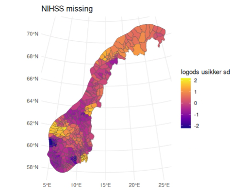
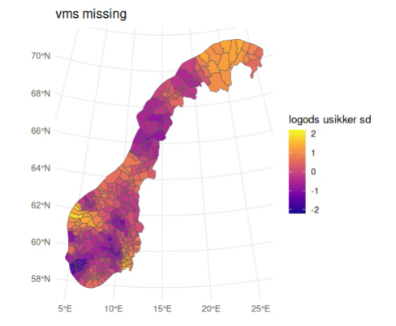
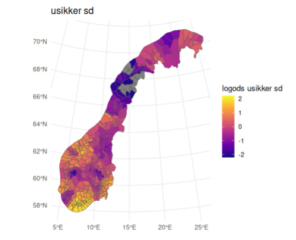

# Descriptive tables

## Uncertain onset stroke vs wakeup-stroke

| Uncertain onset | -1 Not answered | 1 Yes | 2 No | 9 Unknown | Row total |
|---|---:|---:|---:|---:|---:|
| 0 No | 4,460 (6.2%) | 12,765 (17.8%) | 47,003 (65.5%) | 7,550 (10.5%) | 71,778 (81.4%) |
| 1 Yes | 1,956 (11.9%) | 2,747 (16.7%) | 5,200 (31.6%) | 6,547 (39.8%) | 16,450 (18.6%) |
| % | 30.5 | 17.7 | 10.0 | 46.4 | 18.6 |

# onset vs diagnosis
| Stroke diagnosis | Uncertain onset yes / total | % uncertain onset |
|---|---:|---:|
| 1 Hemorrhage | 2,240 / 11,998 | 18.7% |
| 2 Infarct | 13,991 / 75,166 | 18.6% |
| 3 Unspecified | 219 / 1,063 | 20.6% |
| Overall | 16,450 / 88,228 | 18.6% |

## Table 1

| Variabel | Nivå | SymptomdebutUsikker = 0 | SymptomdebutUsikker = 1 | SMD |
|---|---:|---:|---:|---:|
| n |  | 71778 | 16450 |  |
| PatientAge (mean (SD)) |  | 74.06 (13.02) | 74.47 (12.92) | 0.032 |
| Slagdiagnose (%) | -1 | 1 (0.0) | 0 (0.0) | 0.015 |
|  | 1 | 9758 (13.6) | 2240 (13.6) |  |
|  | 2 | 61175 (85.2) | 13991 (85.1) |  |
|  | 3 | 844 (1.2) | 219 (1.3) |  |
| VaaknetMedSymptom (%) | -1 | 4460 (6.2) | 1956 (11.9) | 0.851 |
|  | 1 | 12765 (17.8) | 2747 (16.7) |  |
|  | 2 | 47003 (65.5) | 5200 (31.6) |  |
|  | 9 | 7550 (10.5) | 6547 (39.8) |  |
| HvorOppstoHjerneslaget (%) | -1 | 2297 (3.2) | 1336 (8.1) | 0.235 |
|  | 1 | 65467 (91.2) | 14557 (88.5) |  |
|  | 2 | 4014 (5.6) | 557 (3.4) |  |
| Trombolyse (%) | -1 | 9 (0.0) | 3 (0.0) | 0.664 |
|  | 1 | 14925 (20.8) | 192 (1.2) |  |
|  | 2 | 56683 (79.0) | 16212 (98.6) |  |
|  | 3 | 86 (0.1) | 2 (0.0) |  |
|  | 9 | 75 (0.1) | 41 (0.2) |  |
| BoligforholdPre (%) | -1 | 150 (0.2) | 16 (0.1) | 0.109 |
|  | 1 | 53251 (74.2) | 11629 (70.7) |  |
|  | 2 | 11628 (16.2) | 3221 (19.6) |  |
|  | 3 | 2515 (3.5) | 608 (3.7) |  |
|  | 4 | 3864 (5.4) | 821 (5.0) |  |
|  | 9 | 370 (0.5) | 155 (0.9) |  |
| BosituasjonPre (%) | -1 | 1982 (2.8) | 360 (2.2) | 0.177 |
|  | 1 | 26492 (36.9) | 7335 (44.6) |  |
|  | 2 | 40336 (56.2) | 7909 (48.1) |  |
|  | 3 | 2454 (3.4) | 670 (4.1) |  |
|  | 9 | 514 (0.7) | 176 (1.1) |  |
| SivilstatusPre (%) | -1 | 150 (0.2) | 16 (0.1) | 0.171 |
|  | 1 | 40294 (56.1) | 7912 (48.1) |  |
|  | 2 | 14949 (20.8) | 3881 (23.6) |  |
|  | 3 | 13917 (19.4) | 3836 (23.3) |  |
|  | 9 | 2468 (3.4) | 805 (4.9) |  |
| MRSPre (%) | -1 | 5011 (7.0) | 1452 (8.8) | 0.093 |
|  | 0 | 37274 (51.9) | 8053 (49.0) |  |
|  | 1 | 12027 (16.8) | 2593 (15.8) |  |
|  | 2 | 7977 (11.1) | 2035 (12.4) |  |
|  | 3 | 6141 (8.6) | 1504 (9.1) |  |
|  | 4 | 2939 (4.1) | 717 (4.4) |  |
|  | 5 | 409 (0.6) | 96 (0.6) |  |
| MedikamentellBehandlingForHoeytB (%) | -1 | 71760 (100.0) | 16447 (100.0) | 0.008 |
|  | 1 | 8 (0.0) | 2 (0.0) |  |
|  | 2 | 10 (0.0) | 1 (0.0) |  |
| TidlHjerneslag (%) | -1 | 150 (0.2) | 16 (0.1) | 0.044 |
|  | 1 | 16008 (22.3) | 3690 (22.4) |  |
|  | 2 | 55267 (77.0) | 12620 (76.7) |  |
|  | 9 | 353 (0.5) | 124 (0.8) |  |
| TidlTIA (%) | -1 | 150 (0.2) | 16 (0.1) | 0.065 |
|  | 1 | 7090 (9.9) | 1409 (8.6) |  |
|  | 2 | 62990 (87.8) | 14571 (88.6) |  |
|  | 9 | 1548 (2.2) | 454 (2.8) |  |
| TidlHjerteinfarkt (%) | -1 | 150 (0.2) | 16 (0.1) | 0.040 |
|  | 1 | 9837 (13.7) | 2138 (13.0) |  |
|  | 2 | 61185 (85.2) | 14126 (85.9) |  |
|  | 9 | 606 (0.8) | 170 (1.0) |  |
| Atrieflimmer (%) | -1 | 150 (0.2) | 16 (0.1) | 0.033 |
|  | 1 | 18214 (25.4) | 4083 (24.8) |  |
|  | 2 | 52831 (73.6) | 12203 (74.2) |  |
|  | 9 | 583 (0.8) | 148 (0.9) |  |
| RoeykerPre (%) | -1 | 150 (0.2) | 16 (0.1) | 0.089 |
|  | 0 | 26750 (37.3) | 5956 (36.2) |  |
|  | 1 | 12885 (18.0) | 3403 (20.7) |  |
|  | 2 | 19386 (27.0) | 4036 (24.5) |  |
|  | 9 | 12607 (17.6) | 3039 (18.5) |  |
| PreDiabetes (%) | -1 | 150 (0.2) | 16 (0.1) | 0.070 |
|  | 1 | 13135 (18.3) | 3400 (20.7) |  |
|  | 2 | 58151 (81.0) | 12930 (78.6) |  |
|  | 9 | 342 (0.5) | 104 (0.6) |  |
| NIHSSinnkomst (%) | 0 | 7797 (13.3) | 2050 (18.9) | 0.260 |
|  | 1 | 8387 (14.3) | 1943 (17.9) |  |
|  | 2 | 7939 (13.5) | 1616 (14.9) |  |
|  | 3 | 5893 (10.1) | 1091 (10.1) |  |
|  | 4 | 4614 (7.9) | 802 (7.4) |  |
|  | 5 | 3477 (5.9) | 557 (5.1) |  |
|  | 6 | 2921 (5.0) | 422 (3.9) |  |
|  | 7 | 2136 (3.6) | 355 (3.3) |  |
|  | 8 | 1745 (3.0) | 212 (2.0) |  |
|  | 9 | 1439 (2.5) | 184 (1.7) |  |
|  | 10 | 1296 (2.2) | 175 (1.6) |  |
|  | 11 | 1030 (1.8) | 140 (1.3) |  |
|  | 12 | 1033 (1.8) | 126 (1.2) |  |
|  | 13 | 891 (1.5) | 98 (0.9) |  |
|  | 14 | 875 (1.5) | 100 (0.9) |  |
|  | 15 | 841 (1.4) | 103 (1.0) |  |
|  | 16 | 788 (1.3) | 94 (0.9) |  |
|  | 17 | 784 (1.3) | 91 (0.8) |  |
|  | 18 | 688 (1.2) | 95 (0.9) |  |
|  | 19 | 594 (1.0) | 73 (0.7) |  |
|  | 20 | 605 (1.0) | 108 (1.0) |  |
|  | 21 | 484 (0.8) | 65 (0.6) |  |
|  | 22 | 461 (0.8) | 54 (0.5) |  |
|  | 23 | 383 (0.7) | 56 (0.5) |  |
|  | 24 | 313 (0.5) | 47 (0.4) |  |
|  | 25 | 271 (0.5) | 28 (0.3) |  |
|  | 26 | 149 (0.3) | 24 (0.2) |  |
|  | 27 | 169 (0.3) | 14 (0.1) |  |
|  | 28 | 115 (0.2) | 23 (0.2) |  |
|  | 29 | 73 (0.1) | 8 (0.1) |  |
|  | 30 | 78 (0.1) | 18 (0.2) |  |
|  | 31 | 43 (0.1) | 6 (0.1) |  |
|  | 32 | 47 (0.1) | 7 (0.1) |  |
|  | 33 | 33 (0.1) | 4 (0.0) |  |
|  | 34 | 19 (0.0) | 3 (0.0) |  |
|  | 35 | 26 (0.0) | 4 (0.0) |  |
|  | 36 | 32 (0.1) | 6 (0.1) |  |
|  | 37 | 9 (0.0) | 2 (0.0) |  |
|  | 38 | 19 (0.0) | 2 (0.0) |  |
|  | 39 | 12 (0.0) | 4 (0.0) |  |
|  | 40 | 92 (0.2) | 21 (0.2) |  |
|  | 41 | 4 (0.0) | 0 (0.0) |  |
|  | 42 | 7 (0.0) | 4 (0.0) |  |
| BevissthetsgradInnleggelse (%) | -1 | 150 (0.2) | 16 (0.1) | 0.093 |
|  | 0 | 60766 (84.7) | 14017 (85.2) |  |
|  | 1 | 5721 (8.0) | 1080 (6.6) |  |
|  | 2 | 2229 (3.1) | 500 (3.0) |  |
|  | 3 | 2390 (3.3) | 598 (3.6) |  |
|  | 9 | 522 (0.7) | 239 (1.5) |  |
| PreASA (%) | -1 | 158 (0.2) | 19 (0.1) | 0.047 |
|  | 1 | 22568 (31.4) | 4991 (30.3) |  |
|  | 2 | 48588 (67.7) | 11287 (68.6) |  |
|  | 9 | 464 (0.6) | 153 (0.9) |  |
| PreKlopidogrel (%) | -1 | 158 (0.2) | 19 (0.1) | 0.050 |
|  | 1 | 4714 (6.6) | 998 (6.1) |  |
|  | 2 | 66433 (92.6) | 15267 (92.8) |  |
|  | 9 | 473 (0.7) | 166 (1.0) |  |
| PreDipyridamol (%) | -1 | 158 (0.2) | 19 (0.1) | 0.053 |
|  | 1 | 3190 (4.4) | 646 (3.9) |  |
|  | 2 | 67956 (94.7) | 15618 (94.9) |  |
|  | 9 | 474 (0.7) | 167 (1.0) |  |
| PreWarfarin (%) | -1 | 158 (0.2) | 19 (0.1) | 0.060 |
|  | 1 | 3648 (5.1) | 975 (5.9) |  |
|  | 2 | 67522 (94.1) | 15295 (93.0) |  |
|  | 9 | 450 (0.6) | 161 (1.0) |  |
| PreAndreEnnWarfarin (%) | -1 | 158 (0.2) | 19 (0.1) | 0.047 |
|  | 1 | 7951 (11.1) | 1735 (10.5) |  |
|  | 2 | 63192 (88.0) | 14534 (88.4) |  |
|  | 9 | 477 (0.7) | 162 (1.0) |  |
| PreMedHoeytBT (%) | -1 | 176 (0.2) | 22 (0.1) | 0.046 |
|  | 1 | 39387 (54.9) | 9006 (54.7) |  |
|  | 2 | 31600 (44.0) | 7216 (43.9) |  |
|  | 9 | 615 (0.9) | 206 (1.3) |  |
| PreAndrePeroraleAntikoagulasjons (%) | -1 | 64300 (89.6) | 14886 (90.5) | 0.038 |
|  | 1 | 5068 (7.1) | 1090 (6.6) |  |
|  | 2 | 709 (1.0) | 123 (0.7) |  |
|  | 3 | 1467 (2.0) | 291 (1.8) |  |
|  | 4 | 85 (0.1) | 22 (0.1) |  |
|  | 5 | 149 (0.2) | 38 (0.2) |  |
| PreStatinerLipid (%) | -1 | 158 (0.2) | 19 (0.1) | 0.062 |
|  | 1 | 26670 (37.2) | 5843 (35.5) |  |
|  | 2 | 44422 (61.9) | 10392 (63.2) |  |
|  | 9 | 528 (0.7) | 196 (1.2) |  |
| PreA2Antagonist (%) | -1 | 59051 (82.3) | 12294 (74.7) | 0.185 |
|  | 1 | 2395 (3.3) | 789 (4.8) |  |
|  | 2 | 10197 (14.2) | 3309 (20.1) |  |
|  | 9 | 135 (0.2) | 58 (0.4) |  |
| PreACEhemmer (%) | -1 | 59051 (82.3) | 12294 (74.7) | 0.185 |
|  | 1 | 1599 (2.2) | 547 (3.3) |  |
|  | 2 | 10998 (15.3) | 3548 (21.6) |  |
|  | 9 | 130 (0.2) | 61 (0.4) |  |
| PreBetablokker (%) | -1 | 59051 (82.3) | 12294 (74.7) | 0.186 |
|  | 1 | 4305 (6.0) | 1473 (9.0) |  |
|  | 2 | 8299 (11.6) | 2623 (15.9) |  |
|  | 9 | 123 (0.2) | 60 (0.4) |  |
| PreKalsiumantagonist (%) | -1 | 59051 (82.3) | 12294 (74.7) | 0.185 |
|  | 1 | 2196 (3.1) | 723 (4.4) |  |
|  | 2 | 10399 (14.5) | 3370 (20.5) |  |
|  | 9 | 132 (0.2) | 63 (0.4) |  |
| Aar (%) | 2014 | 6045 (8.4) | 2348 (14.3) | 0.274 |
|  | 2015 | 6690 (9.3) | 1813 (11.0) |  |
|  | 2016 | 6782 (9.4) | 1840 (11.2) |  |
|  | 2017 | 6777 (9.4) | 1986 (12.1) |  |
|  | 2018 | 7530 (10.5) | 1321 (8.0) |  |
|  | 2019 | 7711 (10.7) | 1308 (8.0) |  |
|  | 2020 | 7657 (10.7) | 1276 (7.8) |  |
|  | 2021 | 7740 (10.8) | 1425 (8.7) |  |
|  | 2022 | 7550 (10.5) | 1470 (8.9) |  |
|  | 2023 | 7296 (10.2) | 1663 (10.1) |  |
| ErMann_HSR = 1 (%) |  | 39466 (55.0) | 8841 (53.7) | 0.025 |
| HF (%) | Akershus universitetssykehus HF | 5700 (7.9) | 2332 (14.2) | 0.605 |
|  | Diakonhjemmet sykehus AS | 1338 (1.9) | 342 (2.1) |  |
|  | Finnmarkssykehuset HF | 1008 (1.4) | 144 (0.9) |  |
|  | Haraldsplass Diakonale sykehus AS | 1353 (1.9) | 234 (1.4) |  |
|  | Helgelandssykehuset HF | 1294 (1.8) | 117 (0.7) |  |
|  | Helse Bergen HF | 3904 (5.4) | 727 (4.4) |  |
|  | Helse Fonna HF | 1922 (2.7) | 734 (4.5) |  |
|  | Helse Førde HF | 1473 (2.1) | 479 (2.9) |  |
|  | Helse Møre og Romsdal HF | 3776 (5.3) | 1390 (8.4) |  |
|  | Helse Nord-Trøndelag HF | 2707 (3.8) | 477 (2.9) |  |
|  | Helse Stavanger HF | 4292 (6.0) | 497 (3.0) |  |
|  | Lovisenberg Diakonale sykehus AS | 1250 (1.7) | 349 (2.1) |  |
|  | Nordlandssykehuset HF | 2762 (3.8) | 105 (0.6) |  |
|  | Oslo universitetssykehus HF | 3420 (4.8) | 238 (1.4) |  |
|  | Sørlandet sykehus HF | 2999 (4.2) | 1851 (11.3) |  |
|  | St. Olavs Hospital HF | 5775 (8.0) | 665 (4.0) |  |
|  | Sykehuset i Vestfold HF | 3614 (5.0) | 721 (4.4) |  |
|  | Sykehuset Innlandet HF | 6120 (8.5) | 1001 (6.1) |  |
|  | Sykehuset Østfold HF | 3910 (5.4) | 1487 (9.0) |  |
|  | Sykehuset Telemark HF | 2182 (3.0) | 904 (5.5) |  |
|  | Universitetssykehuset Nord-Norge HF | 4072 (5.7) | 599 (3.6) |  |
|  | Vestre Viken HF | 6907 (9.6) | 1057 (6.4) |  |
| Bo_RHF (%) | 1 | 9135 (12.7) | 974 (5.9) | 0.269 |
|  | 2 | 12148 (16.9) | 2515 (15.3) |  |
|  | 3 | 12932 (18.0) | 2686 (16.3) |  |
|  | 4 | 37526 (52.3) | 10267 (62.4) |  |
| utd_nivaa_3d (%) | -1 | 85 (0.1) | 25 (0.2) | 0.062 |
|  | 0 | 262 (0.4) | 84 (0.5) |  |
|  | 1 | 22524 (31.6) | 5474 (33.6) |  |
|  | 2 | 33549 (47.1) | 7677 (47.1) |  |
|  | 3 | 14758 (20.7) | 3049 (18.7) |  |
| innt4d_samlet (%) | 1 | 17608 (24.5) | 4372 (26.6) | 0.069 |
|  | 2 | 17780 (24.8) | 4200 (25.5) |  |
|  | 3 | 17921 (25.0) | 4057 (24.7) |  |
|  | 4 | 18226 (25.4) | 3754 (22.8) |  |
|  | 9 | 243 (0.3) | 67 (0.4) |  |
| husinnt4d_samlet (%) | 1 | 17223 (24.0) | 4757 (28.9) | 0.142 |
|  | 2 | 17642 (24.6) | 4337 (26.4) |  |
|  | 3 | 18322 (25.5) | 3658 (22.2) |  |
|  | 4 | 18348 (25.6) | 3631 (22.1) |  |
|  | 9 | 243 (0.3) | 67 (0.4) |  |
| Sentralitetsklasse_SSB (%) | 1 | 10014 (14.0) | 2132 (13.0) | 0.155 |
|  | 2 | 17518 (24.4) | 3608 (21.9) |  |
|  | 3 | 18100 (25.2) | 5121 (31.1) |  |
|  | 4 | 12015 (16.7) | 2667 (16.2) |  |
|  | 5 | 9555 (13.3) | 2211 (13.4) |  |
|  | 6 | 4539 (6.3) | 703 (4.3) |  |
| Sentralitetsindeks_SSB (mean (SD)) |  | 798.28 (136.30) | 802.88 (125.43) | 0.035 |
| CoMorb_kat (%) | -1 | 23610 (32.9) | 5455 (33.2) | 0.023 |
|  | 0 | 25275 (35.2) | 5632 (34.2) |  |
|  | 1 | 16411 (22.9) | 3808 (23.1) |  |
|  | 2 | 6482 (9.0) | 1555 (9.5) |  |

## RHF vs uncertain symp

| RHF | SymptomdebutUsikker = 0 | SymptomdebutUsikker = 1 | Totalt | Andel usikker symptomdebut |
|---|---:|---:|---:|---:|
| HN | 9,135 | 974 | 10,109 | 9.6% |
| HMN | 12,148 | 2,515 | 14,663 | 17.2% |
| HV | 12,932 | 2,686 | 15,618 | 17.2% |
| HSØ | 37,526 | 10,267 | 47,793 | 21.5% |

## HF vs uncertain symp

| HF | SymptomdebutUsikker = 0 | SymptomdebutUsikker = 1 | Totalt | Andel usikker symptomdebut |
|---|---:|---:|---:|---:|
| Sørlandet sykehus HF | 2,999 | 1,851 | 4,850 | 38.2% |
| Sykehuset Telemark HF | 2,182 | 904 | 3,086 | 29.3% |
| Akershus universitetssykehus HF | 5,700 | 2,332 | 8,032 | 29.0% |
| Helse Fonna HF | 1,922 | 734 | 2,656 | 27.6% |
| Sykehuset Østfold HF | 3,910 | 1,487 | 5,397 | 27.6% |
| Helse Møre og Romsdal HF | 3,776 | 1,390 | 5,166 | 26.9% |
| Helse Førde HF | 1,473 | 479 | 1,952 | 24.5% |
| Lovisenberg Diakonale sykehus AS | 1,250 | 349 | 1,599 | 21.8% |
| Diakonhjemmet sykehus AS | 1,338 | 342 | 1,680 | 20.4% |
| Sykehuset i Vestfold HF | 3,614 | 721 | 4,335 | 16.6% |
| Helse Bergen HF | 3,904 | 727 | 4,631 | 15.7% |
| Helse Nord-Trøndelag HF | 2,707 | 477 | 3,184 | 15.0% |
| Haraldsplass Diakonale sykehus AS | 1,353 | 234 | 1,587 | 14.7% |
| Sykehuset Innlandet HF | 6,120 | 1,001 | 7,121 | 14.1% |
| Vestre Viken HF | 6,907 | 1,057 | 7,964 | 13.3% |
| Universitetssykehuset Nord-Norge HF | 4,072 | 599 | 4,671 | 12.8% |
| Finnmarkssykehuset HF | 1,008 | 144 | 1,152 | 12.5% |
| Helse Stavanger HF | 4,292 | 497 | 4,789 | 10.4% |
| St. Olavs Hospital HF | 5,775 | 665 | 6,440 | 10.3% |
| Helgelandssykehuset HF | 1,294 | 117 | 1,411 | 8.3% |
| Oslo universitetssykehus HF | 3,420 | 238 | 3,658 | 6.5% |
| Nordlandssykehuset HF | 2,762 | 105 | 2,867 | 3.7% |

## HF vs missing vms
| HF                                  | VMS not missing | VMS missing | Total | Andel VMS missing | Andel usikker symptomdebut |
| ----------------------------------- | --------------: | ----------: | ----: | ----------------: | -------------------------: |
| Lovisenberg Diakonale sykehus AS    |           1,004 |         595 | 1,599 |         **37.2%** |                      21.8% |
| Helse Førde HF                      |           1,306 |         646 | 1,952 |         **33.1%** |                      24.5% |
| Sykehuset Østfold HF                |           3,748 |       1,649 | 5,397 |         **30.6%** |                      27.6% |
| Finnmarkssykehuset HF               |             803 |         349 | 1,152 |         **30.3%** |                      12.5% |
| Diakonhjemmet sykehus AS            |           1,216 |         464 | 1,680 |         **27.6%** |                      20.4% |
| Akershus universitetssykehus HF     |           5,896 |       2,136 | 8,032 |         **26.6%** |                      29.0% |
| Haraldsplass Diakonale sykehus AS   |           1,170 |         417 | 1,587 |         **26.3%** |                      14.7% |
| Helse Nord-Trøndelag HF             |           2,358 |         826 | 3,184 |         **25.9%** |                      15.0% |
| Oslo universitetssykehus HF         |           2,738 |         920 | 3,658 |         **25.2%** |                       6.5% |
| Sørlandet sykehus HF                |           3,666 |       1,184 | 4,850 |         **24.4%** |                      38.2% |
| Helse Fonna HF                      |           2,023 |         633 | 2,656 |         **23.8%** |                      27.6% |
| Helse Møre og Romsdal HF            |           3,990 |       1,176 | 5,166 |         **22.8%** |                      26.9% |
| Sykehuset Innlandet HF              |           5,540 |       1,581 | 7,121 |         **22.2%** |                      14.1% |
| Universitetssykehuset Nord-Norge HF |           3,642 |       1,029 | 4,671 |         **22.0%** |                      12.8% |
| Sykehuset i Vestfold HF             |           3,388 |         947 | 4,335 |         **21.8%** |                      16.6% |
| St. Olavs Hospital HF               |           5,051 |       1,389 | 6,440 |         **21.6%** |                      10.3% |
| Nordlandssykehuset HF               |           2,256 |         611 | 2,867 |         **21.3%** |                       3.7% |
| Sykehuset Telemark HF               |           2,440 |         646 | 3,086 |         **20.9%** |                      29.3% |
| Vestre Viken HF                     |           6,480 |       1,484 | 7,964 |         **18.6%** |                      13.3% |
| Helgelandssykehuset HF              |           1,150 |         261 | 1,411 |         **18.5%** |                       8.3% |
| Helse Bergen HF                     |           3,785 |         846 | 4,631 |         **18.3%** |                      15.7% |
| Helse Stavanger HF                  |           4,065 |         724 | 4,789 |         **15.1%** |                      10.4% |

## RHF vs missing vms
| RHF                  | VMS not missing | VMS missing |  Total | Andel VMS missing | Andel usikker symptomdebut |
| -------------------- | --------------: | ----------: | -----: | ----------------: | -------------------------: |
| Helse Sør-Øst RHF    |          36,181 |      11,612 | 47,793 |         **24.3%** |                  **21.5%** |
| Helse Midt-Norge RHF |          11,286 |       3,377 | 14,663 |         **23.0%** |                  **17.2%** |
| Helse Nord RHF       |           7,867 |       2,242 | 10,109 |         **22.2%** |                   **9.6%** |
| Helse Vest RHF       |          12,344 |       3,274 | 15,618 |         **21.0%** |                  **17.2%** |

| Variable | Level | vms_missing = 0 | vms_missing = 1 | % vms_missing within row | SMD |
|---|---|---:|---:|---:|---:|
| n |  | 67,715 | 20,513 | 23.2% |  |
| Aar (%) | 2014 | 6,758 (10.0) | 1,635 (8.0) | 19.5% | 0.306 |
|  | 2015 | 6,928 (10.2) | 1,575 (7.7) | 18.5% |  |
|  | 2016 | 7,021 (10.4) | 1,601 (7.8) | 18.6% |  |
|  | 2017 | 7,000 (10.3) | 1,763 (8.6) | 20.1% |  |
|  | 2018 | 7,202 (10.6) | 1,649 (8.0) | 18.6% |  |
|  | 2019 | 7,417 (11.0) | 1,602 (7.8) | 17.8% |  |
|  | 2020 | 6,191 (9.1) | 2,742 (13.4) | 30.7% |  |
|  | 2021 | 6,301 (9.3) | 2,864 (14.0) | 31.2% |  |
|  | 2022 | 6,296 (9.3) | 2,724 (13.3) | 30.2% |  |
|  | 2023 | 6,601 (9.7) | 2,358 (11.5) | 26.3% |  |
| PatientAge, mean (SD) |  | 73.75 (13.08) | 75.43 (12.63) |  | 0.131 |
| Slagdiagnose (%) | Hjerneblødning | 8,993 (13.3) | 3,005 (14.6) | 25.0% | 0.045 |
|  | Hjerneinfarkt | 57,938 (85.6) | 17,228 (84.0) | 22.9% |  |
|  | Uspesifisert | 783 (1.2) | 280 (1.4) | 26.3% |  |
|  | Ikke besvart | 1 (0.0) | 0 (0.0) | 0.0% |  |
| SymptomdebutUsikker = 1 (%) |  | 7,947 (11.7) | 8,503 (41.5) | 51.7% | 0.714 |
| NIHSS_missing = 1 (%) |  | 11,828 (17.5) | 6,953 (33.9) | 37.0% | 0.383 |
| HvorOppstoHjerneslaget (%) | Utenfor sykehus | 64,210 (94.8) | 15,814 (77.1) | 19.8% | 0.658 |
|  | Innlagt i sykehus | 3,502 (5.2) | 1,069 (5.2) | 23.4% |  |
|  | Ikke besvart | 3 (0.0) | 3,630 (17.7) | 99.9% |  |
| Trombolyse (%) | Ja | 14,608 (21.6) | 509 (2.5) | 3.4% | 0.618 |
|  | Nei | 52,940 (78.2) | 19,955 (97.3) | 27.4% |  |
|  | Inklusjon i studie | 88 (0.1) | 0 (0.0) | 0.0% |  |
|  | Ukjent | 69 (0.1) | 47 (0.2) | 40.5% |  |
|  | Ikke besvart | 10 (0.0) | 2 (0.0) | 16.7% |  |
| BoligforholdPre (%) | Egen bolig uten hjemmesykepleie | 51,218 (75.6) | 13,662 (66.6) | 21.1% | 0.203 |
|  | Egen bolig med hjemmesykepleie | 10,407 (15.4) | 4,442 (21.7) | 29.9% |  |
|  | Omsorgsbolig med døgnkontinuerlige tjenester | 2,201 (3.3) | 922 (4.5) | 29.5% |  |
|  | Sykehjem, både korttids- og langtidsopphold | 3,417 (5.0) | 1,268 (6.2) | 27.1% |  |
|  | Ukjent | 351 (0.5) | 174 (0.8) | 33.1% |  |
|  | Ikke besvart | 121 (0.2) | 45 (0.2) | 27.1% |  |
| BosituasjonPre (%) | Bodde sammen med noen | 39,361 (58.1) | 8,884 (43.3) | 18.4% | 0.300 |
|  | Bodde alene | 23,961 (35.4) | 9,866 (48.1) | 29.2% |  |
|  | Bodde i institusjon/sykehjem | 2,276 (3.4) | 848 (4.1) | 27.1% |  |
|  | Ukjent | 483 (0.7) | 207 (1.0) | 30.0% |  |
|  | Ikke besvart | 1,634 (2.4) | 708 (3.5) | 30.2% |  |
| SivilstatusPre (%) | Gift/samboende | 39,228 (57.9) | 8,978 (43.8) | 18.6% | 0.289 |
|  | Enke/enkemann | 13,622 (20.1) | 5,208 (25.4) | 27.7% |  |
|  | Enslig | 12,475 (18.4) | 5,278 (25.7) | 29.7% |  |
|  | Ukjent | 2,269 (3.4) | 1,004 (4.9) | 30.7% |  |
|  | Ikke besvart | 121 (0.2) | 45 (0.2) | 27.1% |  |
| MRSPre (%) | Ingen symptomer | 36,501 (53.9) | 8,826 (43.0) | 19.5% | 0.232 |
|  | Ikke betydelig funksjonssvikt | 10,997 (16.2) | 3,623 (17.7) | 24.8% |  |
|  | Lett funksjonssvikt | 7,276 (10.7) | 2,736 (13.3) | 27.3% |  |
|  | Moderat funksjonssvikt | 5,504 (8.1) | 2,141 (10.4) | 28.0% |  |
|  | Alvorlig funksjonssvikt | 2,625 (3.9) | 1,031 (5.0) | 28.2% |  |
|  | Svært alvorlig funksjonssvikt | 351 (0.5) | 154 (0.8) | 30.5% |  |
|  | Ikke besvart | 4,461 (6.6) | 2,002 (9.8) | 31.0% |  |

# NIHSS missing

| Variable | Level | NIHSS_missing = 0 | NIHSS_missing = 1 | % NIHSS_missing within row | SMD |
|---|---|---:|---:|---:|---:|
| n |  | 69,447 | 18,781 | 21.3% |  |
| Aar (%) | 2014 | 6,260 (9.0) | 2,133 (11.4) | 25.4% | 0.226 |
|  | 2015 | 6,289 (9.1) | 2,214 (11.8) | 26.0% |  |
|  | 2016 | 6,351 (9.1) | 2,271 (12.1) | 26.3% |  |
|  | 2017 | 6,599 (9.5) | 2,164 (11.5) | 24.7% |  |
|  | 2018 | 7,062 (10.2) | 1,789 (9.5) | 20.2% |  |
|  | 2019 | 7,205 (10.4) | 1,814 (9.7) | 20.1% |  |
|  | 2020 | 7,188 (10.4) | 1,745 (9.3) | 19.5% |  |
|  | 2021 | 7,430 (10.7) | 1,735 (9.2) | 18.9% |  |
|  | 2022 | 7,460 (10.7) | 1,560 (8.3) | 17.3% |  |
|  | 2023 | 7,603 (10.9) | 1,356 (7.2) | 15.1% |  |
| PatientAge, mean (SD) |  | 73.99 (12.90) | 74.67 (13.34) |  | 0.052 |
| Slagdiagnose (%) | Hjerneblødning | 7,605 (11.0) | 4,393 (23.4) | 36.6% | 0.351 |
|  | Hjerneinfarkt | 61,158 (88.1) | 14,008 (74.6) | 18.6% |  |
|  | Uspesifisert | 683 (1.0) | 380 (2.0) | 35.7% |  |
|  | Ikke besvart | 1 (0.0) | 0 (0.0) | 0.0% |  |
| SymptomdebutUsikker = 1 (%) |  | 10,835 (15.6) | 5,615 (29.9) | 34.1% | 0.346 |
| VaaknetMedSymptom (%) | Ja | 12,810 (18.4) | 2,702 (14.4) | 17.4% | 0.416 |
|  | Nei | 43,077 (62.0) | 9,126 (48.6) | 17.5% |  |
|  | Ukjent | 8,793 (12.7) | 5,304 (28.2) | 37.6% |  |
|  | Ikke besvart | 4,767 (6.9) | 1,649 (8.8) | 25.7% |  |
| HvorOppstoHjerneslaget (%) | Utenfor sykehus | 64,220 (92.5) | 15,804 (84.1) | 19.7% | 0.279 |
|  | Innlagt i sykehus | 2,617 (3.8) | 1,954 (10.4) | 42.7% |  |
|  | Ikke besvart | 2,610 (3.8) | 1,023 (5.4) | 28.2% |  |
| Trombolyse (%) | Ja | 14,774 (21.3) | 343 (1.8) | 2.3% | 0.642 |
|  | Nei | 54,506 (78.5) | 18,389 (97.9) | 25.2% |  |
|  | Inklusjon i studie | 87 (0.1) | 1 (0.0) | 1.1% |  |
|  | Ukjent | 70 (0.1) | 46 (0.2) | 39.7% |  |
|  | Ikke besvart | 10 (0.0) | 2 (0.0) | 16.7% |  |
| BoligforholdPre (%) | Egen bolig uten hjemmesykepleie | 52,799 (76.0) | 12,081 (64.3) | 18.6% | 0.296 |
|  | Egen bolig med hjemmesykepleie | 11,025 (15.9) | 3,824 (20.4) | 25.8% |  |
|  | Omsorgsbolig med døgnkontinuerlige tjenester | 2,199 (3.2) | 924 (4.9) | 29.6% |  |
|  | Sykehjem, både korttids- og langtidsopphold | 3,121 (4.5) | 1,564 (8.3) | 33.4% |  |
|  | Ukjent | 303 (0.4) | 222 (1.2) | 42.3% |  |
|  | Ikke besvart | 0 (0.0) | 166 (0.9) | 100.0% |  |
| BosituasjonPre (%) | Bodde sammen med noen | 39,053 (56.2) | 9,192 (48.9) | 19.1% | 0.223 |
|  | Bodde alene | 26,396 (38.0) | 7,431 (39.6) | 22.0% |  |
|  | Bodde i institusjon/sykehjem | 1,983 (2.9) | 1,141 (6.1) | 36.5% |  |
|  | Ukjent | 450 (0.6) | 240 (1.3) | 34.8% |  |
|  | Ikke besvart | 1,565 (2.3) | 777 (4.1) | 33.2% |  |
| SivilstatusPre (%) | Gift/samboende | 38,993 (56.1) | 9,213 (49.1) | 19.1% | 0.202 |
|  | Enke/enkemann | 14,513 (20.9) | 4,315 (23.0) | 22.9% |  |
|  | Enslig | 13,650 (19.7) | 4,103 (21.8) | 23.1% |  |
|  | Ukjent | 2,289 (3.3) | 984 (5.2) | 30.1% |  |
|  | Ikke besvart | 0 (0.0) | 166 (0.9) | 100.0% |  |
| MRSPre (%) | Ingen symptomer | 37,656 (54.2) | 7,671 (40.8) | 16.9% | 0.362 |
|  | Ikke betydelig funksjonssvikt | 11,565 (16.7) | 3,055 (16.3) | 20.9% |  |
|  | Lett funksjonssvikt | 7,725 (11.1) | 2,287 (12.2) | 22.8% |  |
|  | Moderat funksjonssvikt | 5,788 (8.3) | 1,857 (9.9) | 24.3% |  |
|  | Alvorlig funksjonssvikt | 2,527 (3.6) | 1,129 (6.0) | 30.9% |  |
|  | Svært alvorlig funksjonssvikt | 315 (0.5) | 190 (1.0) | 37.6% |  |
|  | Ikke besvart | 3,871 (5.6) | 2,592 (13.8) | 40.1% |  |
| vms_missing = 1 (%) |  | 13,560 (19.5) | 6,953 (37.0) | 33.9% | 0.396 |

### HF vs NIHSS missing

| HF | NIHSS_missing = 0 | NIHSS_missing = 1 | Total | % NIHSS_missing | % vms_missing | % uncertain symptom onset |
|---|---:|---:|---:|---:|---:|---:|
| Sykehuset Østfold HF | 3,018 | 2,379 | 5,397 | 44.1% | 30.6% | 27.6% |
| Helse Førde HF | 1,093 | 859 | 1,952 | 44.0% | 33.1% | 24.5% |
| Helse Nord-Trøndelag HF | 2,091 | 1,093 | 3,184 | 34.3% | 25.9% | 15.0% |
| Universitetssykehuset Nord-Norge HF | 3,235 | 1,436 | 4,671 | 30.7% | 22.0% | 12.8% |
| Finnmarkssykehuset HF | 848 | 304 | 1,152 | 26.4% | 30.3% | 12.5% |
| Lovisenberg Diakonale sykehus AS | 1,209 | 390 | 1,599 | 24.4% | 37.2% | 21.8% |
| Nordlandssykehuset HF | 2,172 | 695 | 2,867 | 24.2% | 21.3% | 3.7% |
| Sykehuset Innlandet HF | 5,431 | 1,690 | 7,121 | 23.7% | 22.2% | 14.1% |
| Sykehuset i Vestfold HF | 3,332 | 1,003 | 4,335 | 23.1% | 21.8% | 16.6% |
| Helse Møre og Romsdal HF | 4,033 | 1,133 | 5,166 | 21.9% | 22.8% | 26.9% |
| Helgelandssykehuset HF | 1,122 | 289 | 1,411 | 20.5% | 18.5% | 8.3% |
| Akershus universitetssykehus HF | 6,518 | 1,514 | 8,032 | 18.8% | 26.6% | 29.0% |
| Sørlandet sykehus HF | 3,941 | 909 | 4,850 | 18.7% | 24.4% | 38.2% |
| Diakonhjemmet sykehus AS | 1,397 | 283 | 1,680 | 16.8% | 27.6% | 20.4% |
| Vestre Viken HF | 6,639 | 1,325 | 7,964 | 16.6% | 18.6% | 13.3% |
| Helse Fonna HF | 2,218 | 438 | 2,656 | 16.5% | 23.8% | 27.6% |
| Oslo universitetssykehus HF | 3,056 | 602 | 3,658 | 16.5% | 25.2% | 6.5% |
| Helse Stavanger HF | 4,103 | 686 | 4,789 | 14.3% | 15.1% | 10.4% |
| Haraldsplass Diakonale sykehus AS | 1,360 | 227 | 1,587 | 14.3% | 26.3% | 14.7% |
| St. Olavs Hospital HF | 5,556 | 884 | 6,440 | 13.7% | 21.6% | 10.3% |
| Sykehuset Telemark HF | 2,788 | 298 | 3,086 | 9.7% | 20.9% | 29.3% |
| Helse Bergen HF | 4,287 | 344 | 4,631 | 7.4% | 18.3% | 15.7% |

# reg model

| Model | Predictor | Log-odds β | 95% CrI | OR | OR 95% CrI | 
|---|---|---:|---:|---:|---:|
| Model 1 | Intercept | -1.688 | -1.709 to -1.668 | 0.18 | 0.18 to 0.19 | 
| Model 1 | NIHSS_missing | 0.836 | 0.799 to 0.873 | 2.31 | 2.22 to 2.39 |
| Model 2 | Intercept | -2.018 | -2.041 to -1.994 | 0.13 | 0.13 to 0.14 | 
| Model 2 | vms_missing | 1.672 | 1.636 to 1.709 | 5.32 | 5.13 to 5.52 | 
| Model 3 | Intercept | -2.203 | -2.231 to -2.176 | 0.11 | 0.11 to 0.11 |
| Model 3 | vms_missing | 1.753 | 1.708 to 1.797 | 5.77 | 5.52 to 6.03 | 
| Model 3 | NIHSS_missing | 0.829 | 0.777 to 0.882 | 2.29 | 2.17 to 2.42 | 
| Model 3 | NIHSS_missing × vms_missing | -0.523 | -0.602 to -0.444 | 0.59 | 0.55 to 0.64 |

# maps

